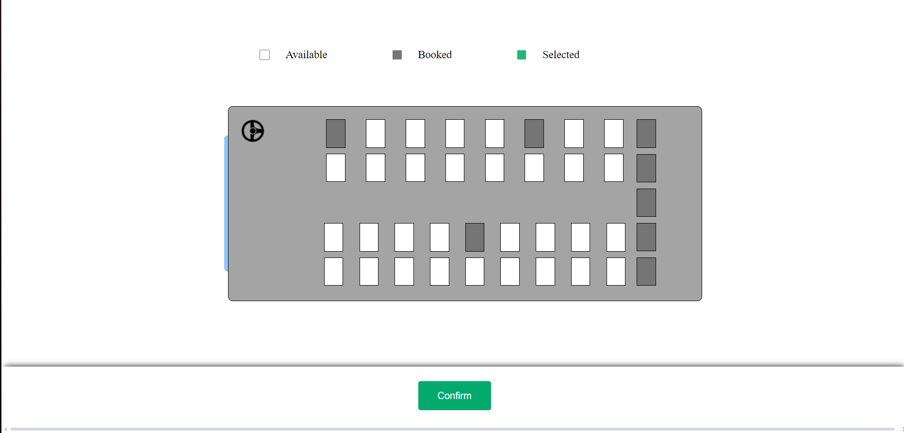

# IIIT-A Bus Booking System

A web application for booking buses at IIIT Allahabad. This system allows students to easily book seats on college buses, view schedules, and manage their bookings efficiently.

## Features

- User Authentication (Sign Up, Login, Logout)
- Book Bus Seats
- View Bus Schedules
- View your Bookings
- Responsive Design

## Installation

1. **Clone the repository:**
   ```bash
   git clone https://github.com/Menma420/IIITA-Bus-Booking.git
   ```
2. **Navigate to the project directory:**
   ```bash
   cd IIITA-Bus-Booking
   ```
3. **Set up the virtual environment:**
   ```bash
   python -m venv venv
   ```
4. **Activate the virtual environment:**
   - On Windows:
     ```bash
     venv\Scripts\activate
     ```
   - On macOS/Linux:
     ```bash
     source venv/bin/activate
     ```
5. **Install the dependencies:**
   ```bash
   pip install -r requirements.txt
   ```
6. **Set up the database:**
   - Configure the database settings in `config.py`.
   - Apply migrations:
     ```bash
     flask db upgrade
     ```
7. **Run the application:**
   ```bash
   flask run
   ```

## Usage

1. **Sign Up / Login:**
   - Create an account or log in with your existing credentials.
2. **Book a Bus Seat:**
   - Navigate to the booking page and select your preferred bus and seat.
3. **View Bookings:**
   - Check your current bookings under the "My Bookings" section.

## Screenshots




## Technologies Used

- **Frontend:** HTML, CSS, JavaScript
- **Backend:** Flask (Python)
- **Database:** MySQL
- **Version Control:** Git

## Contributing

Contributions are welcome! Please follow these steps:

1. Fork the repository.
2. Create a new branch (`git checkout -b feature-branch`).
3. Make your changes.
4. Commit your changes (`git commit -m 'Add some feature'`).
5. Push to the branch (`git push origin feature-branch`).
6. Open a pull request.


## Contact

If you have any questions or suggestions, feel free to contact me at [uttkarshmalviya90@gmail.com](mailto:uttkarshmalviya90@gmail.com).

---

Feel free to modify the template to better suit your project.
