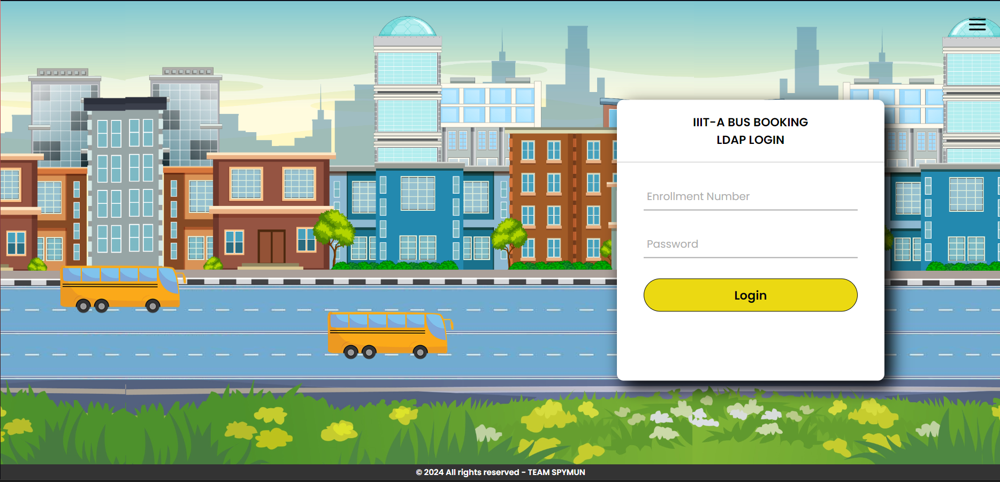

# IIIT-A Bus Booking System

A web application for booking buses at IIIT Allahabad. This system allows students to easily book seats on college buses, view schedules, and manage their bookings efficiently.

## Features

- User Authentication (Sign Up, Login, Logout)
- Book Bus Seats
- View Bus Schedules
- View your Bookings
- Responsive Design

## Usage

1. **Sign Up / Login:**
   - Create an account or log in with your existing credentials.
2. **Book a Bus Seat:**
   - Navigate to the booking page and select your preferred bus and seat.
3. **View Bookings:**
   - Check your current bookings under the "My Bookings" section.

## Screenshots

## Technologies Used

- **Frontend:** HTML, CSS, JavaScript
- **Backend:** Flask (Python)
- **Database:** MySQL
- **Version Control:** Git

## Team Members

- Sahul Kumar
- Priyanshi Khataniya
- Yagesh Mishra - [@Yagesh001](https://github.com/Yagesh001)
- Uttkarsh Malviya - [@Menma420](https://github.com/Menma420)
- Nishant Narjinary - [heyyybooo](https://github.com/heyyybooo)
